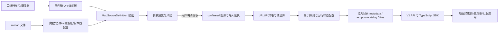

# OpenMapBridge 技术交底书

<!-- TECH_DISCLOSURE_META_START -->
- `document_id`: `OMB-TD-001`
- `version`: `0.1.0-draft`
- `created_at`: `2026-08-28T15:38:26.604+08:00`
- `last_updated_at`: `2026-08-28T15:39:03.084+08:00`
- `basis_commit`: `cc71b3c196b9`
- `source_fingerprint_sha256`: `b537e1e787e46ce9be2792ae3575dced1e208e23aa474cdf5f4e7151e179cef4`
- `status`: `持续更新中的技术事实稿`
<!-- TECH_DISCLOSURE_META_END -->

## 0. 文档性质与使用边界

本文是 OpenMapBridge 的技术事实交底稿，用于工程交接、开源协作、方案复核以及后续知识产权材料的技术供稿。本文不是专利授权结论、法律意见或对现有技术的穷尽检索结果。项目已经公开在 GitHub；如拟用于任何法域的专利申请，应由专业代理人员结合公开时间、权利人、发明人贡献、现有技术和目标法域规则另行判断。

本文只描述 clean-room 独立实现和可复核行为，不复制奥维软件的专有代码、密钥、认证数据、真实二维码载荷、私有图源地址或用户影像。“奥维/Ovi”仅用于说明兼容输入与边界，不表示官方关联、授权或背书。

文档控制：

| 项目 | 当前值 |
|---|---|
| 权威仓库 | `https://github.com/LegalInvest/open-map-bridge` |
| 保密状态 | 公开技术稿；禁止写入秘密或私有样本 |
| 技术贡献者 | 待实际贡献者逐项确认，不从提交用户名自动推定 |
| 权利主体/申请主体 | 待用户与专业代理人员确认 |
| 更新方式 | 事件驱动源码指纹；CI 防陈旧 |

## 1. 技术名称

一种将异构地图源配置安全归一化、按真实能力开放并支持多时相地理影像消费的方法、系统及开发接口。

项目实现名：**OpenMapBridge**。

## 2. 技术领域

本方案涉及地理信息系统、Web 地图、非可信配置解析、本地安全网关、地图瓦片代理、时序遥感影像、多视图空间同步和软件扩展接口。重点覆盖：

1. 二维码和 `.ovmap` 等异构地图配置的安全导入；
2. 私有边界输入到开放地图源定义的归一化；
3. 图源元数据、日期目录和瓦片能力的最小授权开放；
4. 任意区域跨期影像的对齐、选择、显示和事实回执；
5. 面向二次开发的版本化本地 API 与 TypeScript SDK。

## 3. 背景与现有方式的局限

用户常通过二维码、地图配置文件、在线服务地址或本地数据包取得地图源。现有使用方式通常存在以下割裂：

- 配置内容不可读，用户只能在导入后通过“是否显示”猜测有效性；
- 解析成功、网络可达、瓦片有效、投影正确和授权合法经常被混为一个“成功”；
- 配置可能包含过期地址、共享 token、私网地址、错误模板或特定客户端版本字段；
- 二维码、`.ovmap`、XYZ/TMS、时序影像和行业插件往往各自维护数据模型；
- 下游开发者若直接读取原始格式或上游模板，会与私有布局耦合并扩大凭证泄漏面；
- 历史影像对比容易把请求日期误写为拍摄日期，把空白/重复瓦片误写为真实年份，或因不同视角造成伪变化。

公开 GIS 组件、标准地图协议、格式转换器和时序遥感工具可分别解决局部问题，但本项目当前没有证据证明存在一个可直接复用且同时覆盖“非可信导入—安全确认—能力晋级—脱敏二次开发—多时相事实回执”完整链路的单一项目。该判断只针对已记录的研究范围，不构成全球现有技术穷尽结论。

## 4. 要解决的技术问题

### 4.1 非可信输入问题

如何在不访问输入中声明的服务器、不泄漏秘密且不遭受解压炸弹或畸形记录攻击的前提下，识别二维码/文件中的一个或多个地图源候选。

### 4.2 统一内核问题

如何让二维码、`.ovmap` 和标准协议只作为边界适配器，而使渲染、历史影像和插件持续依赖一个稳定、版本化的开放模型。

### 4.3 事实晋级问题

如何严格区分 `parsed`、`confirmed`、`probed`、`rendered`、`saved` 等事实，并避免未探测图源被下游当成可用地图。

### 4.4 二次开发安全问题

如何让行业应用读取合法图源能力，却无法取得原始二维码、文件字节、上游 host/path/query、凭证引用或任意代理能力。

### 4.5 时序真实性问题

如何在任意框选区域内选择跨约 20 年的最多四期影像，维持统一空间视图，同时保留缺年、未知日期、请求失败和拍摄日期未知等真实状态。

## 5. 总体技术方案

系统采用“非可信边界适配器—开放源定义—本地安全网关—能力目录—消费应用”的分层结构。



关键原则是：**输入格式不成为内部真值，名称或协议不成为能力证据，客户端参数不成为上游请求权力。**

## 6. 关键技术方案一：双入口的零外联安全解析

### 6.1 二维码入口

浏览器负责从摄像头或图片中识别二维码图形，载荷进入本地回环网关。网关执行：

1. 字节长度限制；
2. 协议头识别；
3. 显式字段白名单和版本适配；
4. 敏感字段识别与隔离；
5. 生成一个或多个地图源候选及稳定错误码。

解析阶段不对载荷中出现的域名执行 DNS、HTTP、图片预加载或跟踪请求。

### 6.2 `.ovmap` 入口

文件解析不信任扩展名，而依次检查魔数、容器头、压缩边界和记录结构。当前经 fixture 验证的族为 `OviO + record37-zlib`。解析器限制输入尺寸、解压后尺寸、压缩比、记录数、字符串长度和字段范围；未知族保持 `unsupported`，不进行无边界猜测。

单个文件中的多个图层被建模为独立候选。每项具有独立的选择、确认、探测和结果，不因一项失败而把整批写成全部成功或全部失败。

## 7. 关键技术方案二：开放地图源定义与状态机

边界适配器统一输出 `MapSourceDefinition`。其核心字段包括：

- schema 版本、内部 UUID、原系统 legacy ID 和显示名；
- 来源类型、协议、投影、级别、瓦片尺寸和格式；
- 内部上游主机/路径模板和非秘密参数；
- 仅指向本地密钥库的凭证引用；
- 版权/许可、适配器来源、兼容扩展；
- 创建、更新、最后验证时间和事实状态。

状态主链为：

```text
received → parsed → confirmed → probed → rendered → saved
```

异常状态包括 `invalid`、`unsupported`、`blocked`、`needs-credential`、`needs-data`、`probe-failed`、`render-failed`、`stale` 和 `disabled`。后续成功追加新事实，不抹去历史失败回执。

平台 UUID 与 legacy ID 分离，避免不同导入批次或不同客户端编号冲突。原始字节不直接进入渲染器或插件。

## 8. 关键技术方案三：短期预览、显式授权与原子回执

解析结果首先进入具有过期时间的内存预览。确认接口要求：

1. 有效且未消费的 preview ID；
2. 至少一个可选择候选；
3. 候选集合与预览一致；
4. 用户显式确认有权使用；
5. 服务端再次校验，而非只依赖前端勾选状态。

确认后生成稳定 source ID、批次 ID 和 receipt ID，并以临时文件、同步写入、原子 rename 的方式持久化小型 JSON 状态，避免崩溃留下半写文件。回执保存输入哈希、解析器、确认时间、候选结果和错误类别，不保存原始载荷或秘密。

## 9. 关键技术方案四：能力门控的二次开发接口

内部 `MapSourceDefinition` 不直接返回给插件。网关通过字段白名单生成 `DeveloperSourceDescriptor`，只公开：

- V1、source ID、显示名、provider kind；
- 非秘密协议/投影、生命周期和 `metadata-only/ready`；
- 当前真实能力集合；
- 已有能力对应的本地相对链接；
- 可公开的 attribution/license。

明确不公开 hosts、pathTemplate、queryParameters、credentialRef、sourceProvenance、compatibilityExtension、输入哈希和原始字节。

当前能力为：

- `metadata`：所有已确认源可具有；
- `temporal-catalog`：只有已注册且 ready 的时序适配器可具有；
- `tiles`：只有已注册且 ready 的瓦片适配器可具有。

已确认但尚未完成 URL/IP 安全策略、凭证解析、探测和运行时绑定的奥维兼容源只具有 `metadata`。仅配置但未探测的 OviBridge 同样不获得日期/瓦片能力。

TypeScript SDK 校验严格应用清单。清单声明 API 主版本、所需能力和只读权限；未知版本、未知权限、能力—权限不匹配或额外字段失败关闭。SDK 只接受回环 base URL，并在 fetch 前拒绝源不具备的能力。

## 10. 关键技术方案五：本地受控瓦片与时序适配

`TemporalSourceAdapter` 将运行时源抽象为：

```ts
probe(): Promise<ProbeResult>
listDates({ aoiId, from, to }): Promise<TemporalDateEntry[]>
tile({ dateId, z, x, y }): Promise<TemporalTileResponse>
```

开发者瓦片路由只接受 registry 中已有的 source ID、date ID 和整数坐标；拒绝查询参数、任意 URL、host、token 和自定义请求头。z 限制在 0–30，x/y 必须位于当前层级有效范围。

OviBridge 的设计边界是调用已经由官方客户端授权的本机接口，不复现私有认证。base URL 必须是 `127.0.0.1` 或 `localhost`；响应有超时、大小、内容类型和可解码图片限制。若官方服务不能安全限制在回环接口，桥接保持禁用。

真实瓦片探针以 PNG/JPEG 解码为 RGBA 像素后计算哈希，从而避免不同编码元数据影响内容比较；该过程已从 macOS 专用系统工具改为跨平台 `pngjs/jpeg-js` 实现。

## 11. 关键技术方案六：任意区域四期历史影像

用户在地图上绘制矩形或多边形，网关生成 EPSG:4326、版本化、不可变引用的 AOI。截图推算轮廓只能是 `approximate`，用户在真实地图确认后才成为 `confirmed`。

默认窗口是当前 UTC 年之前的 20 个完整自然年。四个锚点包含首尾并近似等距，每个锚点只选一个未使用候选；`available` 优先，`unknown` 可请求，`missing/failed` 排除。候选不足时显示真实数量，不复制邻年。

每个 `TemporalDateEntry` 分开记录：

- `requestDate`：向源请求的日期；
- `captureDate`：源明确返回的拍摄日期，否则为 null；
- `precision`：拍摄日期或仅请求日期；
- `availability`：available/missing/unknown/failed；
- `provenance`：日期事实来源。

1/2/4 屏共享可序列化 ViewState（中心、缩放、旋转、投影），但每屏独立保留 loading/loaded/partial/missing/failed 和瓦片计数。同步事件带来源并合并，避免视图循环。污染、过度养殖或过度开发只可作为假设，除非存在独立数据证据。

## 12. 系统模块与数据流

| 模块 | 职责 | 关键边界 |
|---|---|---|
| `packages/qr-import` | QR 载荷适配 | 不联网、显式版本、未知失败 |
| `packages/ovmap-codec` | 容器和记录解析 | 魔数、有界解压、版本 fixture |
| `packages/source-schema` | 开放源定义、错误和状态机 | 私有输入不得穿透 |
| `apps/gateway/src/import` | 预览、确认、回执 | 服务端授权门、一次性预览 |
| `apps/gateway/src/storage` | AOI/比较/导入状态 | 原子写入、结构化恢复 |
| `packages/temporal-source` | 日期、窗口、四期、ViewState | 请求/拍摄/可用性分离 |
| `apps/gateway/src/temporal` | 合成源和 OviBridge | 回环、大小/内容/日期限制 |
| `packages/developer-sdk` | 描述、清单、SDK | 能力/权限在 fetch 前校验 |
| `apps/web` | 导入与历史影像工作台 | 不直接访问上游秘密 |

端到端事实流：

```text
input received
→ offline parsed candidates
→ user-confirmed definitions + receipts
→ security/vault/probe/runtime binding
→ truthful capabilities
→ SDK/API consumption
→ rendered tile/frame receipts
```

## 13. 预期技术效果

在不承诺尚未测量的性能百分比前提下，本方案产生以下可观察效果：

1. 预览阶段对上游请求数为 0；
2. 未授权、未知格式或越界压缩不会创建活动图源；
3. 插件响应中的上游模板、凭证引用和输入载荷暴露数为 0；
4. 未绑定运行时的图源不会获得日期或瓦片能力；
5. 一个多图层文件可逐项成功/失败并独立审计；
6. 缺失年份、请求日期和拍摄日期不会被伪造成同一事实；
7. 二次开发应用不因奥维边界格式变化而修改其核心调用；
8. 同一 AOI 的多屏交互视角可保持一致，单屏失败不污染其他屏状态。

## 14. 可提炼的技术特征组合（候选）

以下是后续现有技术检索和权利要求分析的技术候选，不表示已经具备新颖性或创造性：

### 候选 A：非可信地图配置的零外联分阶段导入

将格式识别、有界解析、脱敏预览、用户授权、最小探测、渲染和保存建模为不可跨越的事实状态，并在授权前禁止任何由输入触发的网络访问。

### 候选 B：内部源定义与公开能力描述的双模型隔离

内部模型保留运行所需上游字段，公开模型以白名单和能力证据生成；能力由运行时绑定状态决定，而不是由输入协议、名称或文件来源推断。

### 候选 C：能力—权限—本地链接三重一致性校验

应用清单权限、源能力和公开链接必须一致；任一缺失时客户端在发网前拒绝，服务端再次校验，且客户端永远不能提交任意上游 URL。

### 候选 D：请求日期与拍摄日期分离的四期选择

在动态完整年窗口内，以唯一锚点选择和显式 availability/precision 生成最多四期，并把真实非空瓦片加载作为 loaded 回执前提。

### 候选 E：兼容边界与消费内核解耦

二维码和私有容器只经版本适配器产生开放定义；渲染器、时序比较和行业插件不读取原始私有字节，格式扩展不改变消费接口。

## 15. 代表性实施例

### 实施例一：二维码导入后供行业应用发现

用户上传一张有权使用的二维码图片。浏览器识别载荷，本地网关离线解析并返回脱敏候选。用户确认后保存 source ID 和回执。此时开发者目录只返回 `metadata`。待该 source ID 完成安全策略、凭证和探测绑定后，目录才增加 `tiles` 或 `temporal-catalog`，行业应用无需重新解析二维码。

### 实施例二：一个 `.ovmap` 含多个图层

系统验证容器后有界解压并读取多个记录。预览分别显示图层兼容状态。用户选择其中部分图层，确认接口逐项保存；不支持或缺数据项保留独立错误。插件只能看到已确认 source ID 的公开描述。

### 实施例三：20 年四期对比

用户绘制任意多边形。系统生成 confirmed AOI 版本，计算最近 20 个完整年并列出源日期事实，选择最多四个唯一时期。四屏共享 ViewState，各自记录瓦片加载结果。某一时期 404 或超时时，其他屏保持可用，整体结果不写成全部成功。

## 16. 可替换实施方式

- 持久层可由当前原子 JSON 替换为 SQLite/PostgreSQL，但必须保留状态和回执语义；
- Web UI 可包装为 Tauri/移动端，但输入适配器、schema 和 SDK 契约保持；
- 地图渲染器可替换，只要不读取私有字节且保留 ViewState/加载事实；
- 运行时源可为 OviBridge、XYZ/TMS、WMTS/WMS、ArcGIS、STAC/COG 或本地瓦片库；
- 开发 SDK 可扩展到其他语言，但必须实现同一 V1 描述、能力和权限门；
- 日期选择可采用其他窗口策略，但不得伪造 captureDate、availability 或 loaded。

## 17. 当前实现与证据边界

### 已实现并本地/远端验证

- QR 图片/摄像头入口、已验证 QR 结构族的脱敏预览；
- `record37-zlib` `.ovmap` 家族和公开五图层兼容 fixture；
- `MapSourceDefinition`、状态机、短期预览、显式授权、原子保存和回执；
- 任意 AOI、动态 20 年窗口、唯一四期、四屏、卷帘、播放和错误隔离；
- V1 开发者目录、严格应用清单、TypeScript SDK 和本地日期/瓦片路由；
- 跨平台 PNG/JPEG 像素归一化探针；
- GitHub `main`、Apache-2.0、公共 CI 和 Chrome E2E。

### 尚未完成，不得跨级声称

- 真实奥维二维码对应 source ID 的凭证保险库和 URL/IP SSRF 全门；
- 同一 imported source ID 到 OviBridge/标准适配器的运行时绑定；
- 真实奥维历史源的至少两个不同日期非空瓦片；
- 真实 AOI 的四期用户独立签收；
- 公网部署、企业组织权限、插件市场和任意插件代码执行；
- `.sdb` 完整离线数据导入和所有历史 `.ovmap` 家族兼容。

当前合成源通过只证明消费契约，不证明真实奥维图源已渲染。

## 18. 附图建议

1. 图 1：总体分层与信任边界图；
2. 图 2：QR/`.ovmap` 双入口解析与状态晋级流程；
3. 图 3：内部源定义到公开能力描述的字段隔离图；
4. 图 4：应用清单、SDK 能力断言和服务端二次校验时序图；
5. 图 5：AOI、日期目录、四期选择和多屏 ViewState 数据流；
6. 图 6：导入回执、探测回执和帧回执的追溯关系。

## 19. 后续取证清单

- 对候选 A–E 分别执行专利/论文/开源代码/产品文档现有技术检索；
- 固定合法、可公开或可保密使用的最小 fixture 和哈希；
- 记录真实源探测的环境、版本、source ID、日期、非空像素哈希和错误类别；
- 对 SSRF、DNS 重绑定、凭证泄漏、开放代理和能力误晋级做负面测试；
- 将附图从当前 Mermaid/文字说明转为编号一致的正式图；
- 由实际贡献者复核发明人/作者贡献，不从 Git 提交名自动推断法律身份。

## 20. 实时维护机制

交底书采用“事件驱动更新＋CI 防陈旧”，不采用无意义的定时改时间：

1. `npm run disclosure:update -- "本次技术变化"` 对核心源码、接口、规格和关键技术文档计算 SHA-256；
2. 指纹变化时更新 `last_updated_at`、`basis_commit` 并追加一条变更日志；
3. 指纹未变化时不制造空更新；
4. `npm run disclosure:check` 校验当前工作树与记录指纹；
5. GitHub CI 在测试前执行检查，技术变化但未同步交底书时阻止绿色 main；
6. 创建时间永不覆盖，日志只追加；更正历史错误时新增说明，不把旧事实静默改成从未发生。

## 21. 变更日志

| 更新时间（Asia/Shanghai） | 基线提交 | 源码指纹 | 变更说明 |
|---|---|---|---|
<!-- TECH_DISCLOSURE_LOG_ROWS_START -->
| 2026-08-28T15:39:03.084+08:00 | `cc71b3c196b9` | `b537e1e787e4` | 补充技术交底治理、贡献者确认和工程证据映射 |
| 2026-08-28T15:38:26.604+08:00 | `cc71b3c196b9` | `ea50dce1a97e` | 建立首版技术交底书、源码指纹和 CI 防陈旧机制 |
<!-- TECH_DISCLOSURE_LOG_ROWS_END -->

## 22. 关联证据入口

- 产品与验收真值：[`../goal.md`](../goal.md)
- 工程与证据地图：[`../research.md`](../research.md)
- 当前进度：[`../PROGRESS.md`](../PROGRESS.md)
- 阻塞与边界：[`../BLOCKED.md`](../BLOCKED.md)
- 开放源模型：[`open-map-source-schema.md`](open-map-source-schema.md)
- 二次开发接口：[`developer-sdk.md`](developer-sdk.md)
- 本地运行：[`runbook.md`](runbook.md)
