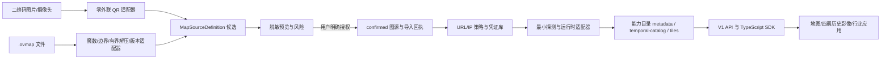

# OpenMapBridge 技术交底书

<!-- TECH_DISCLOSURE_META_START -->
- `document_id`: `OMB-TD-001`
- `version`: `0.1.0-draft`
- `created_at`: `2026-08-28T15:38:26.604+08:00`
- `last_updated_at`: `2026-09-01T03:29:12.672+08:00`
- `basis_commit`: `601ac684fb12`
- `source_fingerprint_sha256`: `eb4729679decfceac636d68580cf119ee50704aa99a98ead97bbd6dbdb5a8d38`
- `status`: `持续更新中的技术事实稿`
<!-- TECH_DISCLOSURE_META_END -->

## 0. 文档性质与使用边界

本文是 OpenMapBridge 的技术事实交底稿，用于工程交接、开源协作、方案复核以及后续知识产权材料的技术供稿。本文不是专利授权结论、法律意见或对现有技术的穷尽检索结果。项目已经公开在 GitHub；如拟用于任何法域的专利申请，应由专业代理人员结合公开时间、权利人、发明人贡献、现有技术和目标法域规则另行判断。

本文只描述 clean-room 独立实现和可复核行为，不复制奥维软件的专有代码、密钥、认证数据、真实二维码载荷、私有图源地址或用户影像。“奥维/Ovi”仅用于说明兼容输入与边界，不表示官方关联、授权或背书。

文档控制：

| 项目 | 当前值 |
|---|---|
| 权威仓库 | `https://github.com/LegalInvest/open-map-bridge` |
| 保密状态 | 公开技术稿；禁止写入秘密或私有样本 |
| 技术贡献者 | 待实际贡献者逐项确认，不从提交用户名自动推定 |
| 权利主体/申请主体 | 待用户与专业代理人员确认 |
| 更新方式 | 事件驱动源码指纹；CI 防陈旧 |

## 1. 技术名称

一种将异构地图源配置安全归一化、按真实能力开放并支持多时相地理影像消费的方法、系统及开发接口。

项目实现名：**OpenMapBridge**。

## 2. 技术领域

本方案涉及地理信息系统、Web 地图、非可信配置解析、本地安全网关、地图瓦片代理、时序遥感影像、多视图空间同步和软件扩展接口。重点覆盖：

1. 二维码和 `.ovmap` 等异构地图配置的安全导入；
2. 私有边界输入到开放地图源定义的归一化；
3. 图源元数据、日期目录和瓦片能力的最小授权开放；
4. 任意区域跨期影像的对齐、选择、显示和事实回执；
5. 面向二次开发的版本化本地 API 与 TypeScript SDK。

## 3. 背景与现有方式的局限

用户常通过二维码、地图配置文件、在线服务地址或本地数据包取得地图源。现有使用方式通常存在以下割裂：

- 配置内容不可读，用户只能在导入后通过“是否显示”猜测有效性；
- 解析成功、网络可达、瓦片有效、投影正确和授权合法经常被混为一个“成功”；
- 配置可能包含过期地址、共享 token、私网地址、错误模板或特定客户端版本字段；
- 二维码、`.ovmap`、XYZ/TMS、时序影像和行业插件往往各自维护数据模型；
- 下游开发者若直接读取原始格式或上游模板，会与私有布局耦合并扩大凭证泄漏面；
- 历史影像对比容易把请求日期误写为拍摄日期，把空白/重复瓦片误写为真实年份，或因不同视角造成伪变化。

公开 GIS 组件、标准地图协议、格式转换器和时序遥感工具可分别解决局部问题，但本项目当前没有证据证明存在一个可直接复用且同时覆盖“非可信导入—安全确认—能力晋级—脱敏二次开发—多时相事实回执”完整链路的单一项目。该判断只针对已记录的研究范围，不构成全球现有技术穷尽结论。

## 4. 要解决的技术问题

### 4.1 非可信输入问题

如何在不访问输入中声明的服务器、不泄漏秘密且不遭受解压炸弹或畸形记录攻击的前提下，识别二维码/文件中的一个或多个地图源候选。

### 4.2 统一内核问题

如何让二维码、`.ovmap` 和标准协议只作为边界适配器，而使渲染、历史影像和插件持续依赖一个稳定、版本化的开放模型。

### 4.3 事实晋级问题

如何严格区分 `parsed`、`confirmed`、`probed`、`rendered`、`saved` 等事实，并避免未探测图源被下游当成可用地图。

### 4.4 二次开发安全问题

如何让行业应用读取合法图源能力，却无法取得原始二维码、文件字节、上游 host/path/query、凭证引用或任意代理能力。

### 4.5 时序真实性问题

如何在任意框选区域内选择跨约 20 年的最多四期影像，维持统一空间视图，同时保留缺年、未知日期、请求失败和拍摄日期未知等真实状态。

### 4.6 跨步骤可观察与可恢复问题

如何把安全检查、凭证人工门、最小探测、运行时绑定、日期目录、四期选择、瓦片质检和比较结果组成可持久、幂等、可续跑的任务，并让用户看到每一步的真实状态、错误、外联事实和下一动作，而不是由前端临时串联或从日志猜测完成状态。

## 5. 总体技术方案

系统采用“非可信边界适配器—开放源定义—本地安全网关—能力目录—消费应用”的分层结构。



关键原则是：**输入格式不成为内部真值，名称或协议不成为能力证据，客户端参数不成为上游请求权力。**

## 6. 关键技术方案一：双入口的零外联安全解析

### 6.1 二维码入口

浏览器负责从摄像头或图片中识别二维码图形，载荷进入本地回环网关。网关执行：

1. 字节长度限制；
2. 协议头识别；
3. 显式字段白名单和版本适配；
4. 敏感字段识别与隔离；
5. 生成一个或多个地图源候选及稳定错误码。

解析阶段不对载荷中出现的域名执行 DNS、HTTP、图片预加载或跟踪请求。

### 6.2 `.ovmap` 入口

文件解析不信任扩展名，而依次检查魔数、容器头、压缩边界和记录结构。当前经 fixture 验证的族为 `OviO + record37-zlib`。解析器限制输入尺寸、解压后尺寸、压缩比、记录数、字符串长度和字段范围；未知族保持 `unsupported`，不进行无边界猜测。

单个文件中的多个图层被建模为独立候选。每项具有独立的选择、确认、探测和结果，不因一项失败而把整批写成全部成功或全部失败。

## 7. 关键技术方案二：开放地图源定义与状态机

边界适配器统一输出 `MapSourceDefinition`。其核心字段包括：

- schema 版本、内部 UUID、原系统 legacy ID 和显示名；
- 来源类型、协议、投影、级别、瓦片尺寸和格式；
- 内部上游传输协议、主机、路径模板、非秘密参数及逐字段来源；
- 仅指向本地密钥库的凭证引用；
- 版权/许可、适配器来源、兼容扩展；
- 创建、更新、最后验证时间和事实状态。

状态主链为：

```text
received → parsed → confirmed → probed → rendered → saved
```

异常状态包括 `invalid`、`unsupported`、`blocked`、`needs-credential`、`needs-data`、`probe-failed`、`render-failed`、`stale` 和 `disabled`。后续成功追加新事实，不抹去历史失败回执。

平台 UUID 与 legacy ID 分离，避免不同导入批次或不同客户端编号冲突。原始字节不直接进入渲染器或插件。

## 8. 关键技术方案三：短期预览、显式授权与原子回执

解析结果首先进入具有过期时间的内存预览。确认接口要求：

1. 有效且未消费的 preview ID；
2. 至少一个可选择候选；
3. 候选集合与预览一致；
4. 用户显式确认有权使用；
5. 服务端再次校验，而非只依赖前端勾选状态。

确认后生成稳定 source ID、批次 ID 和 receipt ID，并以临时文件、同步写入、原子 rename 的方式持久化小型 JSON 状态，避免崩溃留下半写文件。回执保存输入哈希、解析器、确认时间、候选结果和错误类别，不保存原始载荷或秘密。

## 9. 关键技术方案四：能力门控的二次开发接口

内部 `MapSourceDefinition` 不直接返回给插件。网关通过字段白名单生成 `DeveloperSourceDescriptor`，只公开：

- V1、source ID、显示名、provider kind；
- 非秘密协议/投影、生命周期和 `metadata-only/ready`；
- 当前真实能力集合；
- 已有能力对应的本地相对链接；
- 可公开的 attribution/license。

明确不公开 hosts、pathTemplate、queryParameters、credentialRef、sourceProvenance、compatibilityExtension、输入哈希和原始字节。

当前能力为：

- `metadata`：所有已确认源可具有；
- `temporal-catalog`：只有已注册且 ready 的时序适配器可具有；
- `tiles`：只有已注册且 ready 的瓦片适配器可具有。

已确认但尚未完成 URL/IP 安全策略、凭证解析、探测和运行时绑定的奥维兼容源只具有 `metadata`。仅配置但未探测的 OviBridge 同样不获得日期/瓦片能力。

TypeScript SDK 校验严格应用清单。清单声明 API 主版本、所需能力和只读权限；未知版本、未知权限、能力—权限不匹配或额外字段失败关闭。SDK 只接受回环 base URL，并在 fetch 前拒绝源不具备的能力。`FIX-BATCH-003` 已由 main `1d0ebc4` 要求直连 SDK 提供独立应用令牌和 app ID：服务端按源元数据、日期目录、瓦片三类路径重新判权，manifest 不能自行扩大权限；瓦片由带认证头的 `fetchTile` 获取，不把 token 放进 URL。CI `33161851375` 已验证自动门。

本地 gateway 的所有 API 在路由前校验精确回环 Host、允许 Origin、`Sec-Fetch-Site`、constant-time Bearer、写请求 `x-omb-csrf: 1` 和每 principal/IP 固定窗口限流。官方 Web 进程令牌由启动脚本临时生成并仅传给 gateway/Vite 服务端代理，不进入浏览器 bundle；代理注入 token/CSRF 但保留浏览器原始 Origin/Fetch-Site，禁止把跨站请求改写成可信来源；Vite 自身限制回环 Host。开发者令牌只能来自进程环境配置，并绑定唯一 app ID 和只读权限。该门已由 main `1d0ebc4`/CI `33161851375` 验证，但不替代上游请求时 DNS/IP/重绑定策略。

## 10. 关键技术方案五：本地受控瓦片与时序适配

`TemporalSourceAdapter` 将运行时源抽象为：

```ts
probe(): Promise<ProbeResult>
listDates({ aoiId, from, to }): Promise<TemporalDateEntry[]>
tile({ dateId, z, x, y }): Promise<TemporalTileResponse>
```

`FIX-BATCH-005` 已由 main `f84ae20` 把日期窗口与瓦片请求定义为共享严格 schema。日期必须是实际 UTC 日历日且窗口不反向；AOI/date ID 为 1–160 字符、无首尾空白或控制符；路径坐标只接受规范十进制安全非负整数，z≤30 且 x/y<2^z。旧时序 API、V1 开发者 API、SDK、OviBridge 和合成适配器复用该规则，无效输入在适配器 fetch 前失败。HTTP 层保留更早的路径参数长度门：超过服务器门的 URL 返回 414，正常进入路由的非法业务输入才映射为稳定 400；SDK/适配器仍在 fetch 前以共享 schema 拒绝。CI `33164783702` 已验证自动门。

开发者瓦片路由只接受 registry 中已有的 source ID、date ID 和整数坐标；拒绝查询参数、任意 URL、host、token 和自定义请求头。z 限制在 0–30，x/y 必须位于当前层级有效范围。

OviBridge 的设计边界是调用已经由官方客户端授权的本机接口，不复现私有认证。base URL 必须是 IPv4/IPv6 回环地址。`FIX-BATCH-002` 已由 main `de36012` 在 runtime 中增加：读取过程 5 MiB 硬上限、只接受状态 200、其他状态正文隔离、PNG/JPEG MIME 与 magic 一致性、完整像素解码以及单边 2048/像素总量门。CI `33160315934` 已验证自动门；解码成功本身仍不触发 ready。若官方服务不能安全限制在回环接口，桥接保持禁用。

`FIX-BATCH-004` 已由 main `5b6f06e` 删除按年份固定生成 6 月 30 日请求日的工具。OviBridge 只能使用经授权来源核验、通过 `TemporalDateEntry` 严格 schema 并在构造时注入的日期；无目录时 `listDates` 明确失败，未登记 ID 与已登记为 `missing/failed` 的 ID 在零上游请求下返回未找到。已登记的 `availability=unknown` 仍可作为显式探测候选，不能与未登记 ID 混淆。操作者手工输入的四个 probe 日期只属于探测输入，不构成图源目录。CI `33163589956` 已验证自动门；真实目录提供者仍未实现，因此不能证明任何年份或真实影像可用。

`FIX-BATCH-011` 把 OviBridge 从“配置存在”推进到最小运行探测：进程环境只接受最多 500 条通过共享 schema 的非秘密日期元数据和一个已登记、非 `missing/failed` 的 probe 请求。日期输入只允许 `id/requestDate/captureDate/precision/availability`，额外字段失败关闭，公开 provenance 由网关生成固定值，避免配置描述夹带私有内容。应用启动时请求该回环瓦片；只有状态 200、body 非空且继续通过既有 MIME、magic、完整像素解码和尺寸门，registry 才在本次运行中把同一 imported UUID 标为 ready 并开放日期/瓦片能力；无 probe、403、损坏图片或传输异常均保持 configured。该实现已由 PR #20 合并为 runtime source `94e42b1`，PR CI `33379147631` 与 main CI `33379302430` 全门通过。2026-08-31 18:19 本机容量恢复至约 8.62 GiB 后，production build/smoke 通过，同一制品部署为腾讯 current `94e42b1`；gateway/Web hash、health、双回环和持久状态 hash 均通过。它未访问用户真实源，也尚未把 ProbeResult 持久化，因此不能作为真实历史影像验收。

`FIX-BATCH-012` 建立通用 query/header 凭证的本地安全引用层。输入先经严格 bundle schema 限制位置、名称、字段数、单值和总字节，并拒绝 CR/LF/NUL 与重复字段；网关以独立 32-byte master key 和每条随机 96-bit nonce 执行 AES-256-GCM，AAD 绑定 `sourceId`，普通 temporal state 只持久化 `vault://source/<同一 UUID>`。vault 文件使用随机独占 0600 临时文件、sync 和原子 rename；启动时拒绝 group/other 可读文件，并对已有条目执行认证解密，错误 key、篡改、额外顶层字段、重复 source ID 或悬空引用失败关闭。Web 密码表单只允许配置/移除，不回显值；开发者白名单继续排除 credentialRef；readiness 同时要求引用非空且 active vault 真实命中。`OMB-AUD-040` 通过 npm `pre*` 为 test/typecheck/build/dev/production smoke/compat/E2E/fixture acquisition 自动调用 `env:check`，静态 Node 测试冻结映射。PR #23 前两次 CI `33386547512`/`33386726268` 分别发现 hook 拼写和 vault 正例分支错误；第三次 `33386874683` 与 main CI `33387017311` 全绿，FIX-BATCH-012 squash commit `3d1ddf2` 达到 main。19:30 本机约 7.14 GiB，腾讯 current 仍为 `94e42b1`，所以 vault 尚未 deployed、未生成真实 key、未写真实凭证且未发上游请求。该层不解释奥维私有 `at/ad/al` 或不透明 `ul`，也不等于请求时 DNS/IP/连接固定/重绑定门或凭证注入器。

22:44 容量恢复后，精确 docs-only main `3bbcbfa` 通过 198 Vitest＋3 Node、8 workspace typecheck、生产构建和隔离 smoke，并部署为腾讯 current。服务器仅在 root-owned 0600 环境中生成未回显独立 key，服务创建空 0600 vault；health/vault、直连 401、双回环与 state hash 门通过。该证据把 vault 推进 deployed，但没有写入真实凭证或请求上游。

`FIX-BATCH-013` 最初为通用上游建立请求时网络安全传输候选。每次请求以精确 protocol/hostname/port authority 重新解析最多 16 个 DNS 答案，规范化 IPv4/IPv6，永久拒绝云 metadata，并默认拒绝私网、回环、链路本地、CGNAT、保留、文档、组播、IPv4-mapped/NAT64/6to4 等转换地址；企业私网只能按 authority＋精确 IP 显式列入例外。所有答案必须通过后才产生模块内部 WeakSet 登记的不可伪造快照；传输使用 `agent:false`、只返回单个 pinned lookup 地址，并在 socket connect 后复核 remote peer。Node 原生客户端不自动跟随重定向，且禁止调用者覆盖 Host、Forwarded、Proxy、Connection、Content-Length、Transfer-Encoding 等 authority/hop-by-hop 头；下一跳必须重新调用同一授权函数。37 个专项断言包含本机回环真实连接、混合公私 DNS、metadata、mapped IPv6、authority/peer/header 漂移和重定向反例，gateway typecheck 通过且零外部 DNS/HTTP。22:58 全仓门因根卷约 7.59 GiB 被 OMB-AUD-040 在测试主体前阻断，因此当时仍为 local-candidate；后续 main 证据见下一段。

随后提交 `68dac43` 经 PR #25 CI `33406940553` 完整验证并 squash 合并为 main `32cb36d`；main CI `33407144250` 再次通过交底新鲜度、单测/契约、8 workspace typecheck、production build/smoke 和公开 Chrome 旅程。该模块尚未被 server/probe/tile 生产入口导入，所以没有可达 bundle 变化，不另建腾讯 release；阶段为 `main / not wired / not deployed`，OMB-AUD-002 仍 partial。

23:39 的 FIX-BATCH-014 只读设计审查确认必须把两类探测分流。官方 OviBridge 的私有认证由已授权客户端持有，平台只能对回环接口的最小请求生成脱敏 ProbeResult，并以 source UUID、已登记 probe 请求和非秘密配置形成安全输入指纹，避免重启无条件重复外联；通用 vault 不得解释或保存 Ovi 私有 `at/ad/al` 与不透明 `ul`。普通 imported source 则必须先关闭 OMB-AUD-007/008：当前 schema 未保存 transport scheme，归一化器还会删除无法证明为非秘密的常量 query，故不能猜测 `http/https` 或补回 query 后直接接固定传输。只有请求计划事实完整后，才能按同 UUID 解引用 vault、逐请求执行 DNS/IP pinning 并持久化不含上游 URL、凭证或响应正文的 ProbeResult。当前仅为 `discovered / contract only`，没有源码候选、测试或真实请求。

该分流契约及证据随后由 PR #27/#28 进入 main `4730395`；main CI `33410854421` 完整通过。2026-09-01 的阶段 A 候选在 `@omb/source-schema` 增加严格、封闭的 ProbeResult V1，只允许同 source UUID、SHA-256 输入指纹、UTC 起止时间、稳定结果类别/错误码、HTTP 状态、MIME 与成功图片尺寸。OviBridge 用 imported source UUID、导入 SHA、规范回环 origin、mapType、排序后的已验证日期和唯一 probe 坐标计算指纹；首次成功或失败均经原子仓储 `ensureProbeResult` 保存，同指纹重开直接复用，只有持久 `success` 才恢复 runtime ready。持久对象不含 URL、host、日期明细、地图编号、响应正文、异常文本或认证值。成功图片、403、并发去重、重开零重复 fetch 和字段白名单已有 fixture 候选。

该实现已由 PR #29 squash 合并为 runtime source `67ea901`；main CI `33417146165` 在分支 CI `33416581636` 后再次通过技术交底、3 Node、42 文件/241 Vitest、8 workspace typecheck、production build/smoke 与 4 Chrome，首次 CI `33416353555` 的测试语法红灯保留。证据 main `16e805d` 的 CI `33417916800` 亦全绿。因本机仅比 8 GiB 门多约 36 MiB，精确源码流式送入腾讯专用目录，以 Node 24.19/npm 11.17 完成同组测试/类型/build/smoke；gateway/Web hash 匹配 manifest 后安装 release `16e805d` 并原子切换 current。health 200、未鉴权 401、双回环、state/vault hash 不变，临时 build 已删除且旧 `3bbcbfa` 保留。该阶段是 deployed code，不是实际 Ovi ProbeResult、真实渲染或用户验收。

02:29 后容量恢复，阶段 B 形成请求计划真值候选。schema 以 `http/https/unknown` 和 `parsed/inferred/user-corrected/not-provided/redacted/legacy-unknown` 表达传输与字段来源；旧 JSON 可读取但不会因默认值进入外联。二维码绝对 URL 只有与 `hn` 同 authority 且无 userinfo/hash 时才提取 scheme，`.ovmap` host 可安全拆出显式 scheme，公开 query 只接受瓦片变量或 `style/layers/format/time` 等保守常量键，重复键和未知固定值脱敏。OMS 使用完整开放定义重新编号和去凭证引用，保留协议、投影、缩放、瓦片尺寸、格式、多主机、版权/许可与扩展事实；路径或公开参数仍重新执行无秘密门。静态准备度对未知 scheme、未证 provenance 和 HTTP 进入人工门，Ovi 不透明配置仍只走受控本机桥；指纹版本升为 2 并纳入 scheme/query/provenance。PR #32 首轮 CI `33428136462` 的唯一红灯是旧公开 QR E2E 使用相对 `ul` 却期待运行时绑定；新策略正确停在未知 scheme 人工门。夹具改为同 authority 的短显式 HTTPS 模板后第二轮 CI `33428818544` 通过 252 Vitest＋3 Node、8 workspace typecheck、production build/smoke、交底新鲜度和 4 条 Chrome 旅程，策略未放宽；当前没有通用 probe 接线、真实请求、main、部署或 accepted。

PR #32 的证据提交 CI `33429142239` 全绿后 squash 合并为 main `ccd3cd8`，main CI `33429336750` 再次通过完整门。精确 main 本地 build/smoke 产生 gateway `273207cc…b826` 与 Web index `42368f3e…04ad`，腾讯安装 versioned release `ccd3cd8` 并从 `16e805d` 原子切换 current。health 与 nginx health 均为 `atomic-json/encrypted-local`，直连未鉴权 401、4174/8080 双回环、state/vault hash 不变，旧 release 保留。该证据只把请求计划真值推进到 deployed；同 UUID vault 解引用、固定传输、通用 ProbeResult 和真实上游仍未接线。

部署证据 PR #33 CI `33430320616` 全绿并合并为 docs-only main `601ac68`；main CI `33430487066` 再次通过完整门。该后代只更新证据，不改变运行入口或制品，故腾讯 current 正确保留 `ccd3cd8`，没有制造重复 release。

真实瓦片探针以 PNG/JPEG 解码为 RGBA 像素后计算哈希，从而避免不同编码元数据影响内容比较；该过程已从 macOS 专用系统工具改为跨平台 `pngjs/jpeg-js` 实现。

## 11. 关键技术方案六：任意区域四期历史影像

用户在地图上绘制矩形或多边形，网关生成 EPSG:4326、版本化、不可变引用的 AOI。截图推算轮廓只能是 `approximate`，用户在真实地图确认后才成为 `confirmed`。

默认窗口是当前 UTC 年之前的 20 个完整自然年。四个锚点包含首尾并近似等距，每个锚点只选一个未使用候选；`available` 优先，`unknown` 可请求，`missing/failed` 排除。候选不足时显示真实数量，不复制邻年。

每个 `TemporalDateEntry` 分开记录：

- `requestDate`：向源请求的日期；
- `captureDate`：源明确返回的拍摄日期，否则为 null；
- `precision`：拍摄日期或仅请求日期；
- `availability`：available/missing/unknown/failed；
- `provenance`：日期事实来源。

1/2/4 屏共享可序列化 ViewState（中心、缩放、旋转、投影），但每屏独立保留 loading/loaded/partial/missing/failed 和瓦片计数。同步事件带来源并合并，避免视图循环。污染、过度养殖或过度开发只可作为假设，除非存在独立数据证据。

## 11A. 关键技术方案七：可观察的自动任务与人工门

系统以 `AutomationRun` 和 `AutomationStep` 作为跨页、跨重启的任务事实。当前 V1 准备度子集固定 source ID、流程类型、输入/运行时指纹、状态、当前步骤、人工门、时间和下一动作；step 固定步骤类型、状态、尝试次数、起止时间、错误码、是否外联和恢复建议。AOI、结果、trace、步骤级输入输出引用属于后续四期流程扩展。

当前 `source-readiness` 按顺序执行四个零外联步骤：已确认状态、主机/路径静态网络策略、脱敏凭证需求、运行时 registry 绑定。源配置事实或运行时 availability 不变时，重复触发按 SHA-256 指纹返回已有 run；并发创建由串行写队列与临时文件同步/原子 rename 保证只追加一次。该任务不执行 DNS、HTTP 或瓦片解码，完成也只表示准备度静态条件通过，不表示上游可达。

典型一键四期任务按以下顺序执行：

```text
source confirmed
→ URL/IP 安全策略
→ credential / enterprise-host 人工门（如需要）
→ minimal probe
→ runtime binding
→ temporal catalog
→ explainable four-frame selection
→ minimal tile load and quality checks
→ frozen comparison receipt
```

步骤以 `runId + stepKind + sourceId + aoiVersion + inputHash` 形成稳定幂等键。刷新、重启或重复触发不得重复外部探测或保存；只重试未完成或稳定错误标记为可重试的步骤。任务状态从持久业务事件推导，`partial`、`blocked` 和 `unknown` 不得转译为 completed。

授权声明、秘密输入、合法内网主机放行、AOI 冲突、低置信日期选择和因果结论升级作为人工门；其他低风险步骤自动推进。四期选择在等距唯一基线上可加入日期可信度、AOI 覆盖、内容差异和已知质量元数据，未知项不按 0 计分，选择理由随回执输出。

## 12. 系统模块与数据流

| 模块 | 职责 | 关键边界 |
|---|---|---|
| `packages/qr-import` | QR 载荷适配 | 不联网、显式版本、未知失败 |
| `packages/ovmap-codec` | 容器和记录解析 | 魔数、有界解压、版本 fixture |
| `packages/source-schema` | 开放源定义、错误和状态机 | 私有输入不得穿透 |
| `apps/gateway/src/import` | 预览、确认、回执 | 服务端授权门、一次性预览 |
| `apps/gateway/src/storage` | AOI/比较/导入状态 | 原子写入、结构化恢复 |
| `apps/gateway/src/automation` | V1 准备度 run 求值、指纹去重与人工门分类 | 当前零外联；完整续跑/重试待后续 |
| `apps/gateway/src/security` | 入站 Host/Origin/Bearer/CSRF/app 权限/限流；上游主机、端口、IP、云元数据与路径静态策略 | 入站门已进 main；上游请求时 DNS/重绑定门待后续 |
| `packages/temporal-source` | 日期、窗口、四期、ViewState | 请求/拍摄/可用性分离 |
| `apps/gateway/src/temporal` | 合成源和 OviBridge | 回环、大小/内容/日期限制 |
| `packages/developer-sdk` | 描述、清单、SDK | 能力/权限在 fetch 前校验 |
| `apps/web` | 导入与历史影像工作台 | 不直接访问上游秘密 |
| `apps/web/src/automation` | 四步准备度驾驶舱、阻塞和唯一下一动作 | 不从日志或按钮猜状态；完整来源链待后续 |

端到端事实流：

```text
input received
→ offline parsed candidates
→ user-confirmed definitions + receipts
→ security/vault/probe/runtime binding
→ truthful capabilities
→ SDK/API consumption
→ rendered tile/frame receipts
```

## 13. 预期技术效果

在不承诺尚未测量的性能百分比前提下，本方案产生以下可观察效果：

1. 预览阶段对上游请求数为 0；
2. 未授权、未知格式或越界压缩不会创建活动图源；
3. 插件响应中的上游模板、凭证引用和输入载荷暴露数为 0；
4. 未绑定运行时的图源不会获得日期或瓦片能力；
5. 一个多图层文件可逐项成功/失败并独立审计；
6. 缺失年份、请求日期和拍摄日期不会被伪造成同一事实；
7. 二次开发应用不因奥维边界格式变化而修改其核心调用；
8. 同一 AOI 的多屏交互视角可保持一致，单屏失败不污染其他屏状态。
9. 刷新、重启或重复点击不会重复已完成的外部步骤和业务写入；
10. 用户能够从任务状态直接定位授权、凭证、安全、数据或瓦片质量阻塞，并只处理必要人工门。

## 14. 可提炼的技术特征组合（候选）

以下是后续现有技术检索和权利要求分析的技术候选，不表示已经具备新颖性或创造性：

### 候选 A：非可信地图配置的零外联分阶段导入

将格式识别、有界解析、脱敏预览、用户授权、最小探测、渲染和保存建模为不可跨越的事实状态，并在授权前禁止任何由输入触发的网络访问。

### 候选 B：内部源定义与公开能力描述的双模型隔离

内部模型保留运行所需上游字段，公开模型以白名单和能力证据生成；能力由运行时绑定状态决定，而不是由输入协议、名称或文件来源推断。

### 候选 C：能力—权限—本地链接三重一致性校验

应用清单权限、源能力和公开链接必须一致；任一缺失时客户端在发网前拒绝，服务端再次校验，且客户端永远不能提交任意上游 URL。

### 候选 D：请求日期与拍摄日期分离的四期选择

在动态完整年窗口内，以唯一锚点选择和显式 availability/precision 生成最多四期，并把真实非空瓦片加载作为 loaded 回执前提。

### 候选 E：兼容边界与消费内核解耦

二维码和私有容器只经版本适配器产生开放定义；渲染器、时序比较和行业插件不读取原始私有字节，格式扩展不改变消费接口。

### 候选 F：源能力晋级与时序比较的一体化可恢复任务

将图源安全策略、人工门、探测、运行时能力绑定、日期目录、可解释四期选择、最小瓦片质检和比较回执组织为持久步骤图；以幂等键和追加事件支持重启续跑，并让前端从同一事实流可视化真实进度。

## 15. 代表性实施例

### 实施例一：二维码导入后供行业应用发现

用户上传一张有权使用的二维码图片。浏览器识别载荷，本地网关离线解析并返回脱敏候选。用户确认后保存 source ID 和回执。此时开发者目录只返回 `metadata`。待该 source ID 完成安全策略、凭证和探测绑定后，目录才增加 `tiles` 或 `temporal-catalog`，行业应用无需重新解析二维码。

### 实施例二：一个 `.ovmap` 含多个图层

系统验证容器后有界解压并读取多个记录。预览分别显示图层兼容状态。用户选择其中部分图层，确认接口逐项保存；不支持或缺数据项保留独立错误。插件只能看到已确认 source ID 的公开描述。

### 实施例三：20 年四期对比

用户绘制任意多边形。系统生成 confirmed AOI 版本，计算最近 20 个完整年并列出源日期事实，选择最多四个唯一时期。四屏共享 ViewState，各自记录瓦片加载结果。某一时期 404 或超时时，其他屏保持可用，整体结果不写成全部成功。

### 实施例四：导入后自动推进并断点续跑

用户确认一个图源后点击“继续验证并生成四期”。系统创建 run，安全策略通过后执行最小探测；若缺凭证则生成 intervention 并停止外联。用户只在本地凭证界面完成输入后恢复原 run。日期与前三帧成功、第四帧超时时，run 为 partial；网关重启后保留前三帧回执，只重试第四帧，最终生成比较结果而不重复探测和前三帧请求。

## 16. 可替换实施方式

- 持久层可由当前原子 JSON 替换为 SQLite/PostgreSQL，但必须保留状态和回执语义；
- Web UI 可包装为 Tauri/移动端，但输入适配器、schema 和 SDK 契约保持；
- 地图渲染器可替换，只要不读取私有字节且保留 ViewState/加载事实；
- 运行时源可为 OviBridge、XYZ/TMS、WMTS/WMS、ArcGIS、STAC/COG 或本地瓦片库；
- 开发 SDK 可扩展到其他语言，但必须实现同一 V1 描述、能力和权限门；
- 日期选择可采用其他窗口策略，但不得伪造 captureDate、availability 或 loaded。

## 17. 当前实现与证据边界

### 已实现并本地/远端验证

- QR 图片/摄像头入口、已验证 QR 结构族的脱敏预览；
- `record37-zlib` `.ovmap` 家族和公开五图层兼容 fixture；
- `MapSourceDefinition`、状态机、短期预览、显式授权、原子保存和回执；
- 任意 AOI、动态 20 年窗口、唯一四期、四屏、卷帘、播放和错误隔离；
- V1 开发者目录、严格应用清单、TypeScript SDK 和本地日期/瓦片路由；
- 跨平台 PNG/JPEG 像素归一化探针；
- GitHub `main`、Apache-2.0、公共 CI 和 Chrome E2E。

### 尚未完成，不得跨级声称

- 真实奥维二维码对应 source ID 的凭证保险库和 URL/IP SSRF 全门；
- 同一 imported source ID 到 OviBridge/标准适配器的真实探测和 ready 晋级；同 UUID configured 绑定已进 main，但没有真实能力；
- 真实奥维历史源的至少两个不同日期非空瓦片；
- 真实 AOI 的四期用户独立签收；
- 公网部署、企业组织权限、插件市场和任意插件代码执行；
- `.sdb` 完整离线数据导入和所有历史 `.ovmap` 家族兼容。

`AutomationRun/Step` 准备度 V1、四类人工门、原子持久化、输入去重、process/job API 和四步任务驾驶舱已由提交 `16f445c` 进入 main，并经 CI `33155671827` 验证；它不包含真实探测、步骤级断点续跑或一键四期。

2026-08-28 全量静态审计另发现 38 组问题，权威清单为 `docs/问题账本.md`。`FIX-BATCH-001` 已由 PR #1 合并为 main `5a7e9ad`：按显式 persisted imported UUID 注册 configured Ovi runtime、同 legacyId 其他源不绑定、readiness 取消 legacyId 回退、configured 不可进入时序消费、空 probe 返回失败、source UUID/mapType/port 成组配置。CI `33159198541` 已验证自动门；真实日期、真实探测和真实瓦片仍未完成。

`FIX-BATCH-002` 已由 PR #3 进入 main `de36012`，只实现上游响应进入 runtime 前的有界读取、状态/错误正文隔离和图片解码门，不执行 DNS/HTTP 真实探测、不改变 source lifecycle/capability，也不能替代请求时 DNS/IP/重绑定策略。首次 CI `33160137300` 和第二次 `33160229102` 的失败保留在问题账本，第三次 `33160315934` 全绿。

`FIX-BATCH-003` 已由 PR #5 进入 main `1d0ebc4`，建立 gateway 入站信任边界和服务端应用权限：错误 Host/Origin/cross-site/Bearer/app ID/权限/CSRF/配额在业务路由前拒绝；Web token 只在本地服务端进程间传递；SDK 使用独立 scoped token。CI `33161851375` 首轮全绿。该批零真实外联，不解除 vault、上游请求时 DNS/IP、真实 probe/ready 或真实日期阻塞。

`FIX-BATCH-004` 已由 PR #7 进入 main `5b6f06e`：删除虚构年度日期生成器，无已验证目录明确失败，未登记与 `missing/failed` 日期 ID 零请求，并严格验证目录 schema、ID 唯一性和窗口过滤。CI `33163589956` 通过 36 个 Vitest 文件/128 tests＋2 Node、8 workspace typecheck、生产构建和 4 Chrome E2E。真实日期目录提供者、真实 probe/ready 和用户验收继续阻塞。

`FIX-BATCH-005` 已由 PR #9 合并为 main `f84ae20`：共享 schema 接入旧 API、V1、SDK 和两个适配器，并增加实际日期、窗口顺序、ID 边界、规范路径整数与瓦片范围反例。首次 CI `33164557423` 在 161 个 Vitest 中通过 159 个；两个失败证明 Fastify 在路由前以 414 拒绝 161 字符路径参数，原测试误期望业务层 400，该失败被保留。第二次 CI `33164783702` 通过 37 个 Vitest 文件/162 tests＋2 Node、8 workspace typecheck、生产构建、4 Chrome E2E 和交底新鲜度。由于本机低于 8 GiB 门，未运行本地测试/构建。该批零真实外联，也不证明真实日期目录或瓦片可用。

`FIX-BATCH-006` 已由 PR #11 合并为 main `cfab0c2`：把 1 MiB 原始 `.ovmap`、`4*ceil(bytes/3)` base64 上界和 4 KiB JSON 信封预算定义为共享常量，只在 `.ovmap` 检查路由设置计算后的 Fastify `bodyLimit`，不扩大其他 API。Web 客户端在读取、编码和 fetch 前拒绝超限，且移除无业务用途的文件名传输；网关要求规范 base64，并将解码后文件超限与 HTTP 信封超限分别映射为 `INPUT_OVMAP_LIMIT`/`INPUT_BODY_LIMIT` 413。CI `33165515010` 通过 37 个 Vitest 文件/167 tests＋2 Node、8 workspace typecheck、生产构建、4 Chrome E2E 和交底新鲜度。本批不读取真实文件、不发外联，也不解决 QR 图片或预览内存资源门。

`FIX-BATCH-007` 已由 PR #13 合并为 main `873705b`：未确认预览保留既有 15 分钟业务 TTL，并在写入时主动清除过期项；访问顺序 Map 实施默认 64 条和 JSON UTF-8 估算 4 MiB 的双限 LRU，单预览超限稳定 413，内外对象继续结构化克隆。二维码图片在创建 object URL、调用 ZXing 或分配放大 canvas 前，先以声明/实际 8 MiB 字节门读取，再从 PNG/JPEG/WebP 有界文件头取得尺寸并限制 16,777,216 像素；浏览器解码后的尺寸必须与文件头一致；2×/3× 仅在缩放后仍处于同一像素预算时运行。首次 CI `33166210759` 的单元测试通过但 Web BlobPart 严格类型门失败，构建/Chrome 未运行；该失败保留。第二次 CI `33166313733` 通过 39 个 Vitest 文件/175 tests＋2 Node、8 workspace typecheck、生产构建、4 Chrome E2E 和 143 文件交底新鲜度。未读取用户图片、未启动本机浏览器、未外联；相机帧资源治理仍单独开放。

当前合成源通过只证明消费契约，不证明真实奥维图源已渲染。

## 18. 附图建议

1. 图 1：总体分层与信任边界图；
2. 图 2：QR/`.ovmap` 双入口解析与状态晋级流程；
3. 图 3：内部源定义到公开能力描述的字段隔离图；
4. 图 4：应用清单、SDK 能力断言和服务端二次校验时序图；
5. 图 5：AOI、日期目录、四期选择和多屏 ViewState 数据流；
6. 图 6：导入回执、探测回执和帧回执的追溯关系。

## 19. 后续取证清单

- 对候选 A–E 分别执行专利/论文/开源代码/产品文档现有技术检索；
- 固定合法、可公开或可保密使用的最小 fixture 和哈希；
- 记录真实源探测的环境、版本、source ID、日期、非空像素哈希和错误类别；
- 对 SSRF、DNS 重绑定、凭证泄漏、开放代理和能力误晋级做负面测试；
- 将附图从当前 Mermaid/文字说明转为编号一致的正式图；
- 由实际贡献者复核发明人/作者贡献，不从 Git 提交名自动推断法律身份。

## 20. 实时维护机制

交底书采用“事件驱动更新＋CI 防陈旧”，不采用无意义的定时改时间：

1. `npm run disclosure:update -- "本次技术变化"` 对核心源码、接口、规格和关键技术文档计算 SHA-256；
2. 指纹变化时更新 `last_updated_at`、`basis_commit` 并追加一条变更日志；
3. 指纹未变化时不制造空更新；
4. `npm run disclosure:check` 校验当前工作树与记录指纹；
5. GitHub CI 在测试前执行检查，技术变化但未同步交底书时阻止绿色 main；
6. 创建时间永不覆盖，日志只追加；更正历史错误时新增说明，不把旧事实静默改成从未发生。

## 21. 变更日志

| 更新时间（Asia/Shanghai） | 基线提交 | 源码指纹 | 变更说明 |
|---|---|---|---|
<!-- TECH_DISCLOSURE_LOG_ROWS_START -->
| 2026-09-01T03:29:12.672+08:00 | `601ac684fb12` | `eb4729679dec` | finalize FIX-BATCH-014B three-end evidence |
| 2026-09-01T03:23:06.444+08:00 | `ccd3cd88a713` | `5be7d0443b43` | record FIX-BATCH-014B main and Tencent release ccd3cd8 |
| 2026-09-01T03:10:51.170+08:00 | `7af2434e0fdb` | `ab6ea24e1c31` | record FIX-BATCH-014B PR 32 verified CI |
| 2026-09-01T03:07:15.282+08:00 | `cc6d77eaecdb` | `cc45a19937b6` | preserve PR 32 red run and verify corrected E2E |
| 2026-09-01T03:05:27.144+08:00 | `cc6d77eaecdb` | `e833e3c1b6fd` | preserve PR 32 E2E red evidence and correct HTTPS fixture |
| 2026-09-01T02:59:22.756+08:00 | `e9facdf33af4` | `621d20b5cd51` | FIX-BATCH-014B request-plan truth local-verified |
| 2026-09-01T02:56:15.259+08:00 | `e9facdf33af4` | `59f0a1ac342c` | FIX-BATCH-014B request-plan truth local-verified |
| 2026-09-01T01:21:15.074+08:00 | `16e805d98320` | `8aaf7d495374` | 记录 FIX-BATCH-014A 腾讯 release 16e805d 部署与回环状态证据 |
| 2026-09-01T01:05:48.628+08:00 | `67ea9013991b` | `9a15d7455755` | 回写 FIX-BATCH-014A main CI 与容量阻塞部署证据 |
| 2026-09-01T00:57:57.650+08:00 | `8f9d88ffd554` | `35e6ca16894c` | 回写 FIX-BATCH-014A PR 29 第二轮完整 CI 证据 |
| 2026-09-01T00:53:17.112+08:00 | `24dc346cfa3c` | `dab04792ce00` | 保留 PR 29 首次语法红灯并修正 ProbeResult fixture |
| 2026-09-01T00:49:31.152+08:00 | `4730395d3e95` | `a7ea0efda95a` | FIX-BATCH-014A OviBridge ProbeResult 持久化与重启去重候选 |
| 2026-08-31T23:49:27.658+08:00 | `568fc809d89e` | `b06fe4812578` | --message 回写 FIX-BATCH-014 契约 main 与双层 CI 证据 |
| 2026-08-31T23:43:02.055+08:00 | `4252e92fc744` | `4954624e648e` | --message 冻结 FIX-BATCH-014 Ovi ProbeResult 与通用请求计划分流契约 |
| 2026-08-31T23:22:18.484+08:00 | `32cb36d57f6b` | `356ce6faf362` | 同步当前技术基线 |
| 2026-08-31T23:21:55.397+08:00 | `32cb36d57f6b` | `614c4db399e9` | 同步当前技术基线 |
| 2026-08-31T23:09:03.217+08:00 | `3bbcbfabd2d6` | `d83671c93973` | 同步当前技术基线 |
| 2026-08-31T23:06:48.278+08:00 | `3bbcbfabd2d6` | `55dac484095e` | 同步当前技术基线 |
| 2026-08-31T19:38:33.258+08:00 | `3d1ddf2f3e63` | `43d8f5e7b66e` | 回写 FIX-BATCH-012 main 3d1ddf2、PR/main CI 与容量阻塞部署证据 |
| 2026-08-31T19:25:07.658+08:00 | `74c2091bdaae` | `f4b76921a261` | 保留 PR #23 第二次 readiness 正例红灯并收紧缺凭证条件 |
| 2026-08-31T19:23:02.767+08:00 | `f393ecd41fee` | `8855f79da396` | 保留 PR #23 首次容量 hook 拼写红灯并修正 fixture acquisition 前置门 |
| 2026-08-31T19:20:15.831+08:00 | `a92ff8c47308` | `c22fa16ce20d` | FIX-BATCH-012 vault、悬空引用失败关闭、私有 vault 文件门与 OMB-AUD-040 自动容量前置门候选 |
| 2026-08-31T19:15:21.795+08:00 | `a92ff8c47308` | `38e3a1378c6f` | FIX-BATCH-012 vault 与 OMB-AUD-040 自动容量前置门候选；低容量下不执行本地重型门 |
| 2026-08-31T19:01:43.880+08:00 | `a92ff8c47308` | `90657e3a6bbd` | --message FIX-BATCH-012 本地加密凭证保险库与同源引用 local-verified |
| 2026-08-31T18:27:46.051+08:00 | `f21fefe109b6` | `a987ab96fe25` | --message 校正部署回执初始 release 与 current 94e42b1 口径 |
| 2026-08-31T18:26:59.603+08:00 | `f21fefe109b6` | `fd559d48d0e9` | --message 记录 FIX-BATCH-011 腾讯 current 94e42b1 制品、状态与回环验收 |
| 2026-08-31T17:54:12.876+08:00 | `94e42b1e2705` | `c54128c74f25` | 回写 FIX-BATCH-011 main CI 与容量门暂停部署证据 |
| 2026-08-31T17:43:33.533+08:00 | `9b739497c285` | `fea4f8e48809` | 补强 Ovi 探针配置字段白名单和固定 provenance |
| 2026-08-31T17:41:08.167+08:00 | `9b739497c285` | `d5a24dacee1a` | 记录 FIX-BATCH-011 全量测试与低余量容量证据 |
| 2026-08-31T17:37:10.575+08:00 | `9b739497c285` | `b98e864b84c7` | FIX-BATCH-011 Ovi 最小探测与 runtime ready 编排候选 |
| 2026-08-31T16:04:59.689+08:00 | `98f902ca4a88` | `f404570573c9` | 明确证据提交与运行制品哈希一致口径 |
| 2026-08-31T16:01:44.206+08:00 | `62ab11494ae5` | `466706c0a469` | 回写62ab114三端同号与回滚前滚演练 |
| 2026-08-31T15:56:22.356+08:00 | `33f7f06725cd` | `2a506043fbac` | 回写FIX-BATCH-010腾讯私有部署、宝塔nginx路径红灯与三端证据 |
| 2026-08-31T15:44:08.177+08:00 | `b40ed0dab6ef` | `d854b8eb235d` | FIX-BATCH-010腾讯服务器项目专用Node运行时与只读盘点 |
| 2026-08-31T15:35:49.083+08:00 | `382e0e6c9e61` | `32e218f7e9ad` | 增强生产制品manifest完整性与停机竞态验证 |
| 2026-08-31T15:35:21.764+08:00 | `382e0e6c9e61` | `6db57df70b91` | 记录FIX-BATCH-009本地全门与生产冒烟证据 |
| 2026-08-31T15:34:59.713+08:00 | `382e0e6c9e61` | `af87360dd14d` | FIX-BATCH-009独立生产制品部署契约安装前环境门与交底覆盖 |
| 2026-08-31T15:22:01.797+08:00 | `f7fc2c72d21c` | `ba44d759f0aa` | 记录FIX-BATCH-008本地全门与公开QR样本29/29回放证据 |
| 2026-08-31T15:19:06.408+08:00 | `f7fc2c72d21c` | `0faa4bcdb44b` | FIX-BATCH-008兼容已观察QR扩展键且仅保留键名 |
| 2026-08-28T19:16:45.162+08:00 | `873705b06047` | `c058174ae551` | 回写FIX-BATCH-007进入main及完整CI证据 |
| 2026-08-28T19:12:54.682+08:00 | `c92344f6e287` | `91c5a2d71299` | 记录FIX-BATCH-007首次CI类型门失败并修正测试fixture |
| 2026-08-28T19:11:08.189+08:00 | `98a9828a4297` | `5e5c46b3c3cd` | 建立FIX-BATCH-007导入非可信输入资源边界候选 |
| 2026-08-28T19:04:06.428+08:00 | `cfab0c25e3a4` | `949d2859fb86` | 回写FIX-BATCH-006进入main及完整CI证据 |
| 2026-08-28T19:00:08.105+08:00 | `f8733da5d222` | `e23b0c959f10` | 建立FIX-BATCH-006的ovmap上传信封一致性候选 |
| 2026-08-28T18:52:41.273+08:00 | `f84ae200d8cb` | `c338d75fd750` | 回写FIX-BATCH-005进入main及完整CI证据 |
| 2026-08-28T18:48:42.838+08:00 | `05b7efe72529` | `151546901f2a` | 记录FIX-BATCH-005首次CI的HTTP 414边界并修正断言 |
| 2026-08-28T18:44:47.298+08:00 | `1e7308f361ed` | `9e80b9065af6` | 补齐旧API V1 SDK与适配器时序输入边界反例 |
| 2026-08-28T18:44:12.294+08:00 | `1e7308f361ed` | `3694b0b35492` | 统一时序日期窗口ID与瓦片坐标严格schema候选 |
| 2026-08-28T18:33:57.149+08:00 | `5b6f06ecfc93` | `6fd906acea7a` | 回写FIX-BATCH-004主线与CI 33163589956证据 |
| 2026-08-28T18:29:15.270+08:00 | `c73e318a7fdc` | `37c36d1e074c` | 记录FIX-BATCH-004交底删除兼容门与最新候选证据 |
| 2026-08-28T18:28:14.096+08:00 | `c73e318a7fdc` | `64873c34d881` | 删除Ovi虚构年度日期目录并仅接受已验证日期候选 |
| 2026-08-28T18:06:51.325+08:00 | `1d0ebc411b26` | `4c8481b3424f` | 回写FIX-BATCH-003主线与CI 33161851375证据 |
| 2026-08-28T18:02:41.821+08:00 | `99e777a5141b` | `6977598b69fd` | 收紧Vite代理来源保真并补齐gateway入站信任边界反例 |
| 2026-08-28T18:01:00.919+08:00 | `99e777a5141b` | `13d0812ebfed` | 实现本地gateway Host/Origin/Bearer/CSRF/服务端应用权限与限流候选 |
| 2026-08-28T17:44:53.709+08:00 | `de36012d49ba` | `34a43d5a87b5` | 回写FIX-BATCH-002主线、CI红绿证据与问题账本阶段 |
| 2026-08-28T17:40:06.028+08:00 | `b638846fc8cb` | `ac538d375490` | 修正Ovi测试Response BodyInit严格类型并记录第二次CI红灯 |
| 2026-08-28T17:38:47.402+08:00 | `f13f9135c171` | `17681897a91f` | 修正Ovi合法图片流式结果的逐字节回归断言并记录CI红灯 |
| 2026-08-28T17:37:11.392+08:00 | `240b91bae8ca` | `a18e3b5ef17d` | 实现Ovi响应流式上限、状态/错误正文隔离与PNG/JPEG解码门候选 |
| 2026-08-28T17:36:21.657+08:00 | `240b91bae8ca` | `6041a87a38fe` | 实现Ovi响应流式上限、错误正文隔离与PNG/JPEG解码门候选 |
| 2026-08-28T17:28:09.394+08:00 | `5a7e9ad0c2ae` | `95a696d33774` | 回写FIX-BATCH-001主干提交与CI 33159198541证据 |
| 2026-08-28T17:23:20.261+08:00 | `62046627900f` | `21dc817b1b86` | 同步第一批审计修复候选、三元桥接配置、回归测试与容量门事实 |
| 2026-08-28T17:22:41.928+08:00 | `62046627900f` | `d51e73df37b9` | 收紧为source UUID、mapType、port三元桥接配置并补充冲突与空态反例 |
| 2026-08-28T17:21:43.533+08:00 | `62046627900f` | `a4a5c02049b7` | 建立38项问题账本并形成同UUID奥维桥绑定与configured真值修复候选 |
| 2026-08-28T16:34:33.646+08:00 | `16f445c2989e` | `7d490eadd7e1` | 回写 source-readiness 提交与 GitHub CI 验证证据 |
| 2026-08-28T16:30:58.522+08:00 | `7097ba8de31b` | `14f8b8303603` | 补强源级奥维桥 mapType 绑定、编码路径安全门与自动化 API 文档 |
| 2026-08-28T16:29:19.773+08:00 | `7097ba8de31b` | `dd9ab4a383a3` | 实现零外联图源准备度任务、原子去重账本、静态网络策略与任务驾驶舱 |
| 2026-08-28T16:00:39.222+08:00 | `b34fba66d8ac` | `4a4a6bf26b1c` | 同步真实源优先切片与可视化自动化提案边界 |
| 2026-08-28T15:59:42.146+08:00 | `b34fba66d8ac` | `c9a6ab4a5807` | 新增可观察任务驾驶舱、一键四期、人工门、幂等续跑与帧质量路线 |
| 2026-08-28T15:39:03.084+08:00 | `cc71b3c196b9` | `b537e1e787e4` | 补充技术交底治理、贡献者确认和工程证据映射 |
| 2026-08-28T15:38:26.604+08:00 | `cc71b3c196b9` | `ea50dce1a97e` | 建立首版技术交底书、源码指纹和 CI 防陈旧机制 |
<!-- TECH_DISCLOSURE_LOG_ROWS_END -->

## 22. 关联证据入口

- 产品与验收真值：[`../goal.md`](../goal.md)
- 工程与证据地图：[`../research.md`](../research.md)
- 当前进度：[`../PROGRESS.md`](../PROGRESS.md)
- 阻塞与边界：[`../BLOCKED.md`](../BLOCKED.md)
- 开放源模型：[`open-map-source-schema.md`](open-map-source-schema.md)
- 二次开发接口：[`developer-sdk.md`](developer-sdk.md)
- 本地运行：[`runbook.md`](runbook.md)
